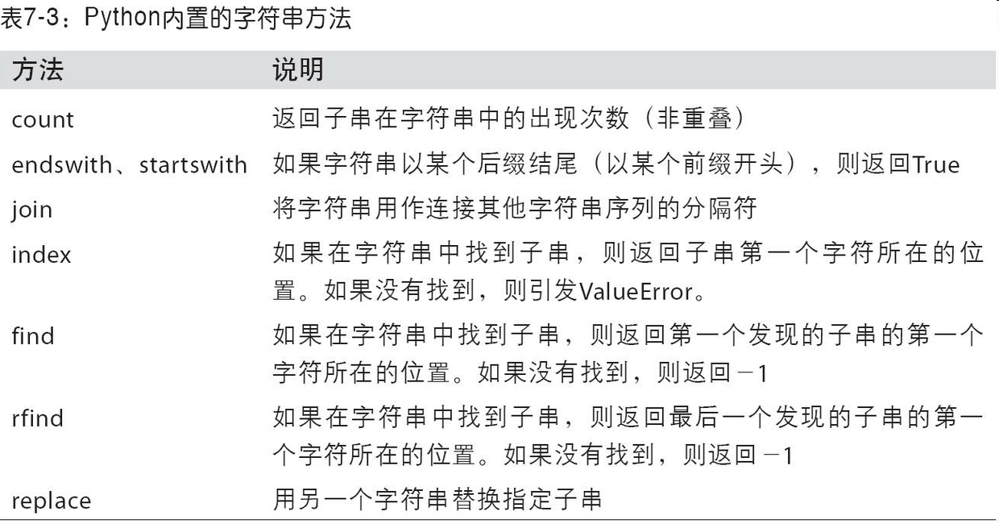
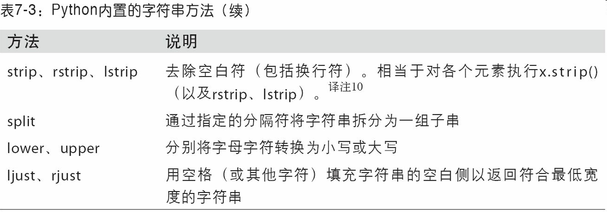
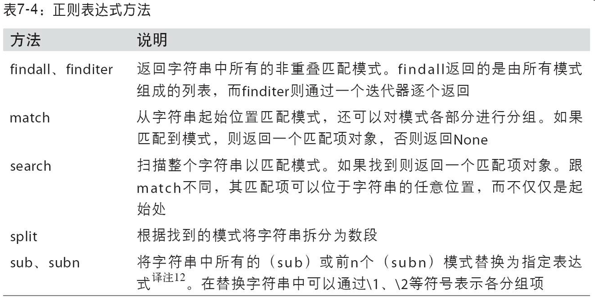
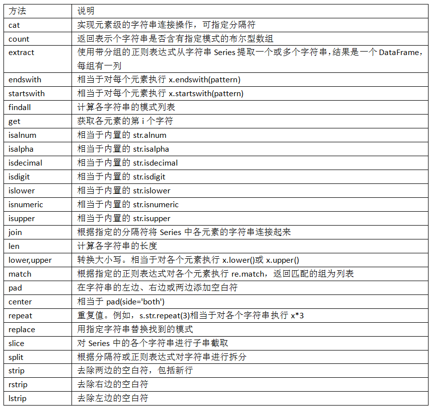

# 第 7 章 数据清洗和准备

在数据分析和建模的过程中，相当多的时间要用在数据准备上：加载、清理、转换以及重塑。这些工作会占到分析师时间的80%或更多。有时，存储在文件和数据库中的数据的格式不适合某个特定的任务。许多研究者都选择使用通用编程语言（如Python、Perl、R或Java）或UNIX文本处理工具（如sed或awk）对数据格式进行专门处理。幸运的是，pandas和内置的Python标准库提供了一组高级的、灵活的、快速的工具，可以让你轻松地将数据规整为想要的格式。

如果你发现了一种本书或pandas库中没有的数据操作方式，请在邮件列表或GitHub网站上提出。实际上，pandas的许多设计和实现都是由真实应用的需求所驱动的。

在本章中，我会讨论处理缺失数据、重复数据、字符串操作和其它分析数据转换的工具。下一章，我会关注于用多种方法合并、重塑数据集。

# 7.1 处理缺失数据
在许多数据分析工作中，缺失数据是经常发生的。pandas的目标之一就是尽量轻松地处理缺失数据。例如，pandas对象的所有描述性统计默认都不包括缺失数据。

缺失数据在pandas中呈现的方式有些不完美，但对于大多数用户可以保证功能正常。对于数值数据，pandas使用浮点值NaN（Not a Number）表示缺失数据。我们称其为哨兵值，可以方便的检测出来：
```python
In [10]: string_data = pd.Series(['aardvark', 'artichoke', np.nan, 'avocado'])

In [11]: string_data
Out[11]:
0     aardvark
1    artichoke
2          NaN
3      avocado
dtype: object

In [12]: string_data.isnull()
Out[12]: 
0    False
1    False
2     True
3    False
dtype: bool
```

在pandas中，我们采用了R语言中的惯用法，即将缺失值表示为NA，它表示不可用not available。在统计应用中，NA数据可能是不存在的数据或者虽然存在，但是没有观察到（例如，数据采集中发生了问题）。当进行数据清洗以进行分析时，最好直接对缺失数据进行分析，以判断数据采集的问题或缺失数据可能导致的偏差。

Python内置的None值在对象数组中也可以作为NA：
```python
In [13]: string_data[0] = None

In [14]: string_data.isnull()
Out[14]: 
0     True
1    False
2     True
3    False
dtype: bool
```

pandas项目中还在不断优化内部细节以更好处理缺失数据，像用户API功能，例如pandas.isnull，去除了许多恼人的细节。表7-1列出了一些关于缺失数据处理的函数。


## 滤除缺失数据
过滤掉缺失数据的办法有很多种。你可以通过pandas.isnull或布尔索引的手工方法，但dropna可能会更实用一些。对于一个Series，dropna返回一个仅含非空数据和索引值的Series：
```python
In [15]: from numpy import nan as NA

In [16]: data = pd.Series([1, NA, 3.5, NA, 7])

In [17]: data.dropna()
Out[17]: 
0    1.0
2    3.5
4    7.0
dtype: float64
```

这等价于：
```python
In [18]: data[data.notnull()]
Out[18]: 
0    1.0
2    3.5
4    7.0
dtype: float64
```

而对于DataFrame对象，事情就有点复杂了。你可能希望丢弃全NA或含有NA的行或列。dropna默认丢弃任何含有缺失值的行：
```python
In [19]: data = pd.DataFrame([[1., 6.5, 3.], [1., NA, NA],
   ....:                      [NA, NA, NA], [NA, 6.5, 3.]])

In [20]: cleaned = data.dropna()

In [21]: data
Out[21]: 
     0    1    2
0  1.0  6.5  3.0
1  1.0  NaN  NaN
2  NaN  NaN  NaN
3  NaN  6.5  3.0

In [22]: cleaned
Out[22]: 
     0    1    2
0  1.0  6.5  3.0
```

传入how='all'将只丢弃全为NA的那些行：
```python
In [23]: data.dropna(how='all')
Out[23]: 
     0    1    2
0  1.0  6.5  3.0
1  1.0  NaN  NaN
3  NaN  6.5  3.0
```

用这种方式丢弃列，只需传入axis=1即可：
```python
In [24]: data[4] = NA

In [25]: data
Out[25]: 
     0    1    2   4
0  1.0  6.5  3.0 NaN
1  1.0  NaN  NaN NaN
2  NaN  NaN  NaN NaN
3  NaN  6.5  3.0 NaN

In [26]: data.dropna(axis=1, how='all')
Out[26]: 
     0    1    2
0  1.0  6.5  3.0
1  1.0  NaN  NaN
2  NaN  NaN  NaN
3  NaN  6.5  3.0
```

另一个滤除DataFrame行的问题涉及时间序列数据。假设你只想留下一部分观测数据，可以用thresh参数实现此目的：
```python
In [27]: df = pd.DataFrame(np.random.randn(7, 3))

In [28]: df.iloc[:4, 1] = NA

In [29]: df.iloc[:2, 2] = NA

In [30]: df
Out[30]: 
          0         1         2
0 -0.204708       NaN       NaN
1 -0.555730       NaN       NaN
2  0.092908       NaN  0.769023
3  1.246435       NaN -1.296221
4  0.274992  0.228913  1.352917
5  0.886429 -2.001637 -0.371843
6  1.669025 -0.438570 -0.539741

In [31]: df.dropna()
Out[31]: 
          0         1         2
4  0.274992  0.228913  1.352917
5  0.886429 -2.001637 -0.371843
6  1.669025 -0.438570 -0.539741

In [32]: df.dropna(thresh=2)
Out[32]: 
          0         1         2
2  0.092908       NaN  0.769023
3  1.246435       NaN -1.296221
4  0.274992  0.228913  1.352917
5  0.886429 -2.001637 -0.371843
6  1.669025 -0.438570 -0.539741
```

## 填充缺失数据
你可能不想滤除缺失数据（有可能会丢弃跟它有关的其他数据），而是希望通过其他方式填补那些“空洞”。对于大多数情况而言，fillna方法是最主要的函数。通过一个常数调用fillna就会将缺失值替换为那个常数值：
```python
In [33]: df.fillna(0)
Out[33]: 
          0         1         2
0 -0.204708  0.000000  0.000000
1 -0.555730  0.000000  0.000000
2  0.092908  0.000000  0.769023
3  1.246435  0.000000 -1.296221
4  0.274992  0.228913  1.352917
5  0.886429 -2.001637 -0.371843
6  1.669025 -0.438570 -0.539741
```

若是通过一个字典调用fillna，就可以实现对不同的列填充不同的值：
```python
In [34]: df.fillna({1: 0.5, 2: 0})
Out[34]: 
          0         1         2
0 -0.204708  0.500000  0.000000
1 -0.555730  0.500000  0.000000
2  0.092908  0.500000  0.769023
3  1.246435  0.500000 -1.296221
4  0.274992  0.228913  1.352917
5  0.886429 -2.001637 -0.371843
6  1.669025 -0.438570 -0.539741
```

fillna默认会返回新对象，但也可以对现有对象进行就地修改：
```python
In [35]: _ = df.fillna(0, inplace=True)

In [36]: df
Out[36]: 
          0         1         2
0 -0.204708  0.000000  0.000000
1 -0.555730  0.000000  0.000000
2  0.092908  0.000000  0.769023
3  1.246435  0.000000 -1.296221
4  0.274992  0.228913  1.352917
5  0.886429 -2.001637 -0.371843
6  1.669025 -0.438570 -0.539741
```

对reindexing有效的那些插值方法也可用于fillna：
```python
In [37]: df = pd.DataFrame(np.random.randn(6, 3))

In [38]: df.iloc[2:, 1] = NA

In [39]: df.iloc[4:, 2] = NA

In [40]: df
Out[40]: 
          0         1         2
0  0.476985  3.248944 -1.021228
1 -0.577087  0.124121  0.302614
2  0.523772       NaN  1.343810
3 -0.713544       NaN -2.370232
4 -1.860761       NaN       NaN
5 -1.265934       NaN       NaN

In [41]: df.fillna(method='ffill')
Out[41]: 
          0         1         2
0  0.476985  3.248944 -1.021228
1 -0.577087  0.124121  0.302614
2  0.523772  0.124121  1.343810
3 -0.713544  0.124121 -2.370232
4 -1.860761  0.124121 -2.370232
5 -1.265934  0.124121 -2.370232

In [42]: df.fillna(method='ffill', limit=2)
Out[42]: 
          0         1         2
0  0.476985  3.248944 -1.021228
1 -0.577087  0.124121  0.302614
2  0.523772  0.124121  1.343810
3 -0.713544  0.124121 -2.370232
4 -1.860761       NaN -2.370232
5 -1.265934       NaN -2.370232
```

只要有些创新，你就可以利用fillna实现许多别的功能。比如说，你可以传入Series的平均值或中位数：
```python
In [43]: data = pd.Series([1., NA, 3.5, NA, 7])

In [44]: data.fillna(data.mean())
Out[44]: 
0    1.000000
1    3.833333
2    3.500000
3    3.833333
4    7.000000
dtype: float64
```
表7-2列出了fillna的参考。


# 7.2 数据转换
本章到目前为止介绍的都是数据的重排。另一类重要操作则是过滤、清理以及其他的转换工作。

## 移除重复数据

DataFrame中出现重复行有多种原因。下面就是一个例子：
```python
In [45]: data = pd.DataFrame({'k1': ['one', 'two'] * 3 + ['two'],
   ....:                      'k2': [1, 1, 2, 3, 3, 4, 4]})

In [46]: data
Out[46]: 
    k1  k2
0  one   1
1  two   1
2  one   2
3  two   3
4  one   3
5  two   4
6  two   4
```

DataFrame的duplicated方法返回一个布尔型Series，表示各行是否是重复行（前面出现过的行）：
```python
In [47]: data.duplicated()
Out[47]: 
0    False
1    False
2    False
3    False
4    False
5    False
6     True
dtype: bool
```

还有一个与此相关的drop_duplicates方法，它会返回一个DataFrame，重复的数组会标为False：
```python
In [48]: data.drop_duplicates()
Out[48]: 
    k1  k2
0  one   1
1  two   1
2  one   2
3  two   3
4  one   3
5  two   4
```

这两个方法默认会判断全部列，你也可以指定部分列进行重复项判断。假设我们还有一列值，且只希望根据k1列过滤重复项：
```python
In [49]: data['v1'] = range(7)

In [50]: data.drop_duplicates(['k1'])
Out[50]: 
    k1  k2  v1
0  one   1   0
1  two   1   1
```

duplicated和drop_duplicates默认保留的是第一个出现的值组合。传入keep='last'则保留最后一个：
```python
In [51]: data.drop_duplicates(['k1', 'k2'], keep='last')
Out[51]: 
    k1  k2  v1
0  one   1   0
1  two   1   1
2  one   2   2
3  two   3   3
4  one   3   4
6  two   4   6
```

## 利用函数或映射进行数据转换
对于许多数据集，你可能希望根据数组、Series或DataFrame列中的值来实现转换工作。我们来看看下面这组有关肉类的数据：
```python
In [52]: data = pd.DataFrame({'food': ['bacon', 'pulled pork', 'bacon',
   ....:                               'Pastrami', 'corned beef', 'Bacon',
   ....:                               'pastrami', 'honey ham', 'nova lox'],
   ....:                      'ounces': [4, 3, 12, 6, 7.5, 8, 3, 5, 6]})

In [53]: data
Out[53]: 
          food  ounces
0        bacon     4.0
1  pulled pork     3.0
2        bacon    12.0
3     Pastrami     6.0
4  corned beef     7.5
5        Bacon     8.0
6     pastrami     3.0
7    honey ham     5.0
8     nova lox     6.0
```

假设你想要添加一列表示该肉类食物来源的动物类型。我们先编写一个不同肉类到动物的映射：
```python
meat_to_animal = {
  'bacon': 'pig',
  'pulled pork': 'pig',
  'pastrami': 'cow',
  'corned beef': 'cow',
  'honey ham': 'pig',
  'nova lox': 'salmon'
}
```

Series的map方法可以接受一个函数或含有映射关系的字典型对象，但是这里有一个小问题，即有些肉类的首字母大写了，而另一些则没有。因此，我们还需要使用Series的str.lower方法，将各个值转换为小写：
```python
In [55]: lowercased = data['food'].str.lower()

In [56]: lowercased
Out[56]: 
0          bacon
1    pulled pork
2          bacon
3       pastrami
4    corned beef
5          bacon
6       pastrami
7      honey ham
8       nova lox
Name: food, dtype: object

In [57]: data['animal'] = lowercased.map(meat_to_animal)

In [58]: data
Out[58]: 
          food  ounces  animal
0        bacon     4.0     pig
1  pulled pork     3.0     pig
2        bacon    12.0     pig
3     Pastrami     6.0     cow
4  corned beef     7.5     cow
5        Bacon     8.0     pig
6     pastrami     3.0     cow
7    honey ham     5.0     pig
8     nova lox     6.0  salmon
```

我们也可以传入一个能够完成全部这些工作的函数：
```python
In [59]: data['food'].map(lambda x: meat_to_animal[x.lower()])
Out[59]: 
0       pig
1       pig
2       pig
3       cow
4       cow
5       pig
6       cow
7       pig
8    salmon
Name: food, dtype: object
```

使用map是一种实现元素级转换以及其他数据清理工作的便捷方式。

## 替换值
利用fillna方法填充缺失数据可以看做值替换的一种特殊情况。前面已经看到，map可用于修改对象的数据子集，而replace则提供了一种实现该功能的更简单、更灵活的方式。我们来看看下面这个Series：
```python
In [60]: data = pd.Series([1., -999., 2., -999., -1000., 3.])

In [61]: data
Out[61]: 
0       1.0
1    -999.0
2       2.0
3    -999.0
4   -1000.0
5       3.0
```

-999这个值可能是一个表示缺失数据的标记值。要将其替换为pandas能够理解的NA值，我们可以利用replace来产生一个新的Series（除非传入inplace=True）：
```python
In [62]: data.replace(-999, np.nan)
Out[62]: 
0       1.0
1       NaN
2       2.0
3       NaN
4   -1000.0
5       3.0
dtype: float64
```

如果你希望一次性替换多个值，可以传入一个由待替换值组成的列表以及一个替换值：：
```python
In [63]: data.replace([-999, -1000], np.nan)
Out[63]: 
0    1.0
1    NaN
2    2.0
3    NaN
4    NaN
5    3.0
dtype: float64
```

要让每个值有不同的替换值，可以传递一个替换列表：
```python
In [64]: data.replace([-999, -1000], [np.nan, 0])
Out[64]: 
0    1.0
1    NaN
2    2.0
3    NaN
4    0.0
5    3.0
dtype: float64
```

传入的参数也可以是字典：
```python
In [65]: data.replace({-999: np.nan, -1000: 0})
Out[65]: 
0    1.0
1    NaN
2    2.0
3    NaN
4    0.0
5    3.0
dtype: float64
```

>笔记：data.replace方法与data.str.replace不同，后者做的是字符串的元素级替换。我们会在后面学习Series的字符串方法。

## 重命名轴索引
跟Series中的值一样，轴标签也可以通过函数或映射进行转换，从而得到一个新的不同标签的对象。轴还可以被就地修改，而无需新建一个数据结构。接下来看看下面这个简单的例子：
```python
In [66]: data = pd.DataFrame(np.arange(12).reshape((3, 4)),
   ....:                     index=['Ohio', 'Colorado', 'New York'],
   ....:                     columns=['one', 'two', 'three', 'four'])
```

跟Series一样，轴索引也有一个map方法：
```python
In [67]: transform = lambda x: x[:4].upper()

In [68]: data.index.map(transform)
Out[68]: Index(['OHIO', 'COLO', 'NEW '], dtype='object')
```

你可以将其赋值给index，这样就可以对DataFrame进行就地修改：
```python
In [69]: data.index = data.index.map(transform)

In [70]: data
Out[70]:
one  two  three  four
OHIO    0    1      2     3
COLO    4    5      6     7
NEW     8    9     10    11
```

如果想要创建数据集的转换版（而不是修改原始数据），比较实用的方法是rename：
```python
In [71]: data.rename(index=str.title, columns=str.upper)
Out[71]: 
      ONE  TWO  THREE  FOUR
Ohio    0    1      2     3
Colo    4    5      6     7
New     8    9     10    11
```

特别说明一下，rename可以结合字典型对象实现对部分轴标签的更新：
```python
In [72]: data.rename(index={'OHIO': 'INDIANA'},
   ....:             columns={'three': 'peekaboo'})
Out[72]:
one  two  peekaboo  four
INDIANA    0    1         2     3
COLO       4    5         6     7
NEW        8    9        10    11
```

rename可以实现复制DataFrame并对其索引和列标签进行赋值。如果希望就地修改某个数据集，传入inplace=True即可：
```python
In [73]: data.rename(index={'OHIO': 'INDIANA'}, inplace=True)

In [74]: data
Out[74]: 
         one  two  three  four
INDIANA    0    1      2     3
COLO       4    5      6     7
NEW        8    9     10    11
```

## 离散化和面元划分
为了便于分析，连续数据常常被离散化或拆分为“面元”（bin）。假设有一组人员数据，而你希望将它们划分为不同的年龄组：
```python
In [75]: ages = [20, 22, 25, 27, 21, 23, 37, 31, 61, 45, 41, 32]
```

接下来将这些数据划分为“18到25”、“26到35”、“35到60”以及“60以上”几个面元。要实现该功能，你需要使用pandas的cut函数：
```python
In [76]: bins = [18, 25, 35, 60, 100]

In [77]: cats = pd.cut(ages, bins)

In [78]: cats
Out[78]: 
[(18, 25], (18, 25], (18, 25], (25, 35], (18, 25], ..., (25, 35], (60, 100], (35,60], (35, 60], (25, 35]]
Length: 12
Categories (4, interval[int64]): [(18, 25] < (25, 35] < (35, 60] < (60, 100]]
```

pandas返回的是一个特殊的Categorical对象。结果展示了pandas.cut划分的面元。你可以将其看做一组表示面元名称的字符串。它的底层含有一个表示不同分类名称的类型数组，以及一个codes属性中的年龄数据的标签：
```python
In [79]: cats.codes
Out[79]: array([0, 0, 0, 1, 0, 0, 2, 1, 3, 2, 2, 1], dtype=int8)

In [80]: cats.categories
Out[80]: 
IntervalIndex([(18, 25], (25, 35], (35, 60], (60, 100]]
              closed='right',
              dtype='interval[int64]')

In [81]: pd.value_counts(cats)
Out[81]: 
(18, 25]     5
(35, 60]     3
(25, 35]     3
(60, 100]    1
dtype: int64
```

pd.value_counts(cats)是pandas.cut结果的面元计数。

跟“区间”的数学符号一样，圆括号表示开端，而方括号则表示闭端（包括）。哪边是闭端可以通过right=False进行修改：
```python
In [82]: pd.cut(ages, [18, 26, 36, 61, 100], right=False)
Out[82]: 
[[18, 26), [18, 26), [18, 26), [26, 36), [18, 26), ..., [26, 36), [61, 100), [36,
 61), [36, 61), [26, 36)]
Length: 12
Categories (4, interval[int64]): [[18, 26) < [26, 36) < [36, 61) < [61, 100)]
```

你可 以通过传递一个列表或数组到labels，设置自己的面元名称：
```python
In [83]: group_names = ['Youth', 'YoungAdult', 'MiddleAged', 'Senior']

In [84]: pd.cut(ages, bins, labels=group_names)
Out[84]: 
[Youth, Youth, Youth, YoungAdult, Youth, ..., YoungAdult, Senior, MiddleAged, Mid
dleAged, YoungAdult]
Length: 12
Categories (4, object): [Youth < YoungAdult < MiddleAged < Senior]
```

如果向cut传入的是面元的数量而不是确切的面元边界，则它会根据数据的最小值和最大值计算等长面元。下面这个例子中，我们将一些均匀分布的数据分成四组：
```python
In [85]: data = np.random.rand(20)

In [86]: pd.cut(data, 4, precision=2)
Out[86]: 
[(0.34, 0.55], (0.34, 0.55], (0.76, 0.97], (0.76, 0.97], (0.34, 0.55], ..., (0.34
, 0.55], (0.34, 0.55], (0.55, 0.76], (0.34, 0.55], (0.12, 0.34]]
Length: 20
Categories (4, interval[float64]): [(0.12, 0.34] < (0.34, 0.55] < (0.55, 0.76] < 
(0.76, 0.97]]
```

选项precision=2，限定小数只有两位。

qcut是一个非常类似于cut的函数，它可以根据样本分位数对数据进行面元划分。根据数据的分布情况，cut可能无法使各个面元中含有相同数量的数据点。而qcut由于使用的是样本分位数，因此可以得到大小基本相等的面元：
```python
In [87]: data = np.random.randn(1000)  # Normally distributed

In [88]: cats = pd.qcut(data, 4)  # Cut into quartiles

In [89]: cats
Out[89]: 
[(-0.0265, 0.62], (0.62, 3.928], (-0.68, -0.0265], (0.62, 3.928], (-0.0265, 0.62]
, ..., (-0.68, -0.0265], (-0.68, -0.0265], (-2.95, -0.68], (0.62, 3.928], (-0.68,
 -0.0265]]
Length: 1000
Categories (4, interval[float64]): [(-2.95, -0.68] < (-0.68, -0.0265] < (-0.0265,
 0.62] <
                                    (0.62, 3.928]]

In [90]: pd.value_counts(cats)
Out[90]:
(0.62, 3.928]       250
(-0.0265, 0.62]     250
(-0.68, -0.0265]    250
(-2.95, -0.68]      250
dtype: int64
```

与cut类似，你也可以传递自定义的分位数（0到1之间的数值，包含端点）：
```python
In [91]: pd.qcut(data, [0, 0.1, 0.5, 0.9, 1.])
Out[91]: 
[(-0.0265, 1.286], (-0.0265, 1.286], (-1.187, -0.0265], (-0.0265, 1.286], (-0.026
5, 1.286], ..., (-1.187, -0.0265], (-1.187, -0.0265], (-2.95, -1.187], (-0.0265, 
1.286], (-1.187, -0.0265]]
Length: 1000
Categories (4, interval[float64]): [(-2.95, -1.187] < (-1.187, -0.0265] < (-0.026
5, 1.286] <
                                    (1.286, 3.928]]
```

本章稍后在讲解聚合和分组运算时会再次用到cut和qcut，因为这两个离散化函数对分位和分组分析非常重要。

## 检测和过滤异常值
过滤或变换异常值（outlier）在很大程度上就是运用数组运算。来看一个含有正态分布数据的DataFrame：
```python
In [92]: data = pd.DataFrame(np.random.randn(1000, 4))

In [93]: data.describe()
Out[93]: 
                 0            1            2            3
count  1000.000000  1000.000000  1000.000000  1000.000000
mean      0.049091     0.026112    -0.002544    -0.051827
std       0.996947     1.007458     0.995232     0.998311
min      -3.645860    -3.184377    -3.745356    -3.428254
25%      -0.599807    -0.612162    -0.687373    -0.747478
50%       0.047101    -0.013609    -0.022158    -0.088274
75%       0.756646     0.695298     0.699046     0.623331
max       2.653656     3.525865     2.735527     3.366626
```

假设你想要找出某列中绝对值大小超过3的值：
```python
In [94]: col = data[2]

In [95]: col[np.abs(col) > 3]
Out[95]: 
41    -3.399312
136   -3.745356
Name: 2, dtype: float64
```

要选出全部含有“超过3或－3的值”的行，你可以在布尔型DataFrame中使用any方法：
```python
In [96]: data[(np.abs(data) > 3).any(1)]
Out[96]: 
            0         1         2         3
41   0.457246 -0.025907 -3.399312 -0.974657
60   1.951312  3.260383  0.963301  1.201206
136  0.508391 -0.196713 -3.745356 -1.520113
235 -0.242459 -3.056990  1.918403 -0.578828
258  0.682841  0.326045  0.425384 -3.428254
322  1.179227 -3.184377  1.369891 -1.074833
544 -3.548824  1.553205 -2.186301  1.277104
635 -0.578093  0.193299  1.397822  3.366626
782 -0.207434  3.525865  0.283070  0.544635
803 -3.645860  0.255475 -0.549574 -1.907459
```

根据这些条件，就可以对值进行设置。下面的代码可以将值限制在区间－3到3以内：
```python
In [97]: data[np.abs(data) > 3] = np.sign(data) * 3

In [98]: data.describe()
Out[98]: 
                 0            1            2            3
count  1000.000000  1000.000000  1000.000000  1000.000000
mean      0.050286     0.025567    -0.001399    -0.051765
std       0.992920     1.004214     0.991414     0.995761
min      -3.000000    -3.000000    -3.000000    -3.000000
25%      -0.599807    -0.612162    -0.687373    -0.747478
50%       0.047101    -0.013609    -0.022158    -0.088274
75%       0.756646     0.695298     0.699046     0.623331
max       2.653656     3.000000     2.735527     3.000000
```

根据数据的值是正还是负，np.sign(data)可以生成1和-1：
```python
In [99]: np.sign(data).head()
Out[99]: 
     0    1    2    3
0 -1.0  1.0 -1.0  1.0
1  1.0 -1.0  1.0 -1.0
2  1.0  1.0  1.0 -1.0
3 -1.0 -1.0  1.0 -1.0
4 -1.0  1.0 -1.0 -1.0
```

## 排列和随机采样
利用numpy.random.permutation函数可以轻松实现对Series或DataFrame的列的排列工作（permuting，随机重排序）。通过需要排列的轴的长度调用permutation，可产生一个表示新顺序的整数数组：
```python
In [100]: df = pd.DataFrame(np.arange(5 * 4).reshape((5, 4)))

In [101]: sampler = np.random.permutation(5)

In [102]: sampler
Out[102]: array([3, 1, 4, 2, 0])
```

然后就可以在基于iloc的索引操作或take函数中使用该数组了：
```python
In [103]: df
Out[103]: 
    0   1   2   3
0   0   1   2   3
1   4   5   6   7
2   8   9  10  11
3  12  13  14  15
4  16  17  18  19

In [104]: df.take(sampler)
Out[104]: 
    0   1   2   3
3  12  13  14  15
1   4   5   6   7
4  16  17  18  19
2   8   9  10  11
0   0   1   2   3
```

如果不想用替换的方式选取随机子集，可以在Series和DataFrame上使用sample方法：
```python
In [105]: df.sample(n=3)
Out[105]: 
    0   1   2   3
3  12  13  14  15
4  16  17  18  19
2   8   9  10  11
```

要通过替换的方式产生样本（允许重复选择），可以传递replace=True到sample：
```python
In [106]: choices = pd.Series([5, 7, -1, 6, 4])

In [107]: draws = choices.sample(n=10, replace=True)

In [108]: draws
Out[108]: 
4    4
1    7
4    4
2   -1
0    5
3    6
1    7
4    4
0    5
4    4
dtype: int64
```

## 计算指标/哑变量
另一种常用于统计建模或机器学习的转换方式是：将分类变量（categorical variable）转换为“哑变量”或“指标矩阵”。

如果DataFrame的某一列中含有k个不同的值，则可以派生出一个k列矩阵或DataFrame（其值全为1和0）。pandas有一个get_dummies函数可以实现该功能（其实自己动手做一个也不难）。使用之前的一个DataFrame例子：
```python
In [109]: df = pd.DataFrame({'key': ['b', 'b', 'a', 'c', 'a', 'b'],
   .....:                    'data1': range(6)})

In [110]: pd.get_dummies(df['key'])
Out[110]: 
   a  b  c
0  0  1  0
1  0  1  0
2  1  0  0
3  0  0  1
4  1  0  0
5  0  1  0
```

有时候，你可能想给指标DataFrame的列加上一个前缀，以便能够跟其他数据进行合并。get_dummies的prefix参数可以实现该功能：
```python
In [111]: dummies = pd.get_dummies(df['key'], prefix='key')

In [112]: df_with_dummy = df[['data1']].join(dummies)

In [113]: df_with_dummy
Out[113]: 
   data1  key_a  key_b  key_c
0      0      0      1      0
1      1      0      1      0
2      2      1      0      0
3      3      0      0      1
4      4      1      0      0
5      5      0      1      0
```

如果DataFrame中的某行同属于多个分类，则事情就会有点复杂。看一下MovieLens 1M数据集，14章会更深入地研究它：
```python
In [114]: mnames = ['movie_id', 'title', 'genres']

In [115]: movies = pd.read_table('datasets/movielens/movies.dat', sep='::',
   .....:                        header=None, names=mnames)

In [116]: movies[:10]
Out[116]: 
   movie_id                               title                        genres
0         1                    Toy Story (1995)   Animation|Children's|Comedy
1         2                      Jumanji (1995)  Adventure|Children's|Fantasy
2         3             Grumpier Old Men (1995)                Comedy|Romance
3         4            Waiting to Exhale (1995)                  Comedy|Drama
4         5  Father of the Bride Part II (1995)                        Comedy
5         6                         Heat (1995)         Action|Crime|Thriller
6         7                      Sabrina (1995)                Comedy|Romance
7         8                 Tom and Huck (1995)          Adventure|Children's
8         9                 Sudden Death (1995)
Action
9        10                    GoldenEye (1995)     Action|Adventure|Thriller
```

要为每个genre添加指标变量就需要做一些数据规整操作。首先，我们从数据集中抽取出不同的genre值：
```python
In [117]: all_genres = []

In [118]: for x in movies.genres:
   .....:     all_genres.extend(x.split('|'))

In [119]: genres = pd.unique(all_genres)
```

现在有：
```python
In [120]: genres
Out[120]: 
array(['Animation', "Children's", 'Comedy', 'Adventure', 'Fantasy',
       'Romance', 'Drama', 'Action', 'Crime', 'Thriller','Horror',
       'Sci-Fi', 'Documentary', 'War', 'Musical', 'Mystery', 'Film-Noir',
       'Western'], dtype=object)
```

构建指标DataFrame的方法之一是从一个全零DataFrame开始：
```python
In [121]: zero_matrix = np.zeros((len(movies), len(genres)))

In [122]: dummies = pd.DataFrame(zero_matrix, columns=genres)
```

现在，迭代每一部电影，并将dummies各行的条目设为1。要这么做，我们使用dummies.columns来计算每个类型的列索引：
```python
In [123]: gen = movies.genres[0]

In [124]: gen.split('|')
Out[124]: ['Animation', "Children's", 'Comedy']

In [125]: dummies.columns.get_indexer(gen.split('|'))
Out[125]: array([0, 1, 2])
```

然后，根据索引，使用.iloc设定值：
```python
In [126]: for i, gen in enumerate(movies.genres):
   .....:     indices = dummies.columns.get_indexer(gen.split('|'))
   .....:     dummies.iloc[i, indices] = 1
   .....:
```

然后，和以前一样，再将其与movies合并起来：
```python
In [127]: movies_windic = movies.join(dummies.add_prefix('Genre_'))

In [128]: movies_windic.iloc[0]
Out[128]: 
movie_id                                       1
title                           Toy Story (1995)
genres               Animation|Children's|Comedy
Genre_Animation                                1
Genre_Children's                               1
Genre_Comedy                                   1
Genre_Adventure                                0
Genre_Fantasy                                  0
Genre_Romance                                  0
Genre_Drama                                    0
                                ...             
Genre_Crime                                    0
Genre_Thriller                                 0
Genre_Horror                                   0
Genre_Sci-Fi                                   0
Genre_Documentary                              0
Genre_War                                      0
Genre_Musical                                  0
Genre_Mystery                                  0
Genre_Film-Noir                                0
Genre_Western                                  0
Name: 0, Length: 21, dtype: object
```

>笔记：对于很大的数据，用这种方式构建多成员指标变量就会变得非常慢。最好使用更低级的函数，将其写入NumPy数组，然后结果包装在DataFrame中。

一个对统计应用有用的秘诀是：结合get_dummies和诸如cut之类的离散化函数：
```python
In [129]: np.random.seed(12345)

In [130]: values = np.random.rand(10)

In [131]: values
Out[131]: 
array([ 0.9296,  0.3164,  0.1839,  0.2046,  0.5677,  0.5955,  0.9645,
        0.6532,  0.7489,  0.6536])

In [132]: bins = [0, 0.2, 0.4, 0.6, 0.8, 1]

In [133]: pd.get_dummies(pd.cut(values, bins))
Out[133]: 
   (0.0, 0.2]  (0.2, 0.4]  (0.4, 0.6]  (0.6, 0.8]  (0.8, 1.0]
0           0           0           0           0           1
1           0           1           0           0           0
2           1           0           0           0           0
3           0           1           0           0           0
4           0           0           1           0           0
5           0           0           1           0           0
6           0           0           0           0           1
7           0           0           0           1           0
8           0           0           0           1           0
9           0           0           0           1           0
```

我们用numpy.random.seed，使这个例子具有确定性。本书后面会介绍pandas.get_dummies。

# 7.3 字符串操作

Python能够成为流行的数据处理语言，部分原因是其简单易用的字符串和文本处理功能。大部分文本运算都直接做成了字符串对象的内置方法。对于更为复杂的模式匹配和文本操作，则可能需要用到正则表达式。pandas对此进行了加强，它使你能够对整组数据应用字符串表达式和正则表达式，而且能处理烦人的缺失数据。

## 字符串对象方法

对于许多字符串处理和脚本应用，内置的字符串方法已经能够满足要求了。例如，以逗号分隔的字符串可以用split拆分成数段：
```python
In [134]: val = 'a,b,  guido'
In [135]: val.split(',')
Out[135]: ['a', 'b', '  guido']
```

split常常与strip一起使用，以去除空白符（包括换行符）：
```python
In [136]: pieces = [x.strip() for x in val.split(',')]

In [137]: pieces
Out[137]: ['a', 'b', 'guido']
```

利用加法，可以将这些子字符串以双冒号分隔符的形式连接起来：
```python
In [138]: first, second, third = pieces

In [139]: first + '::' + second + '::' + third
Out[139]: 'a::b::guido'
```

但这种方式并不是很实用。一种更快更符合Python风格的方式是，向字符串"::"的join方法传入一个列表或元组：
```python
In [140]: '::'.join(pieces)
Out[140]: 'a::b::guido'
```

其它方法关注的是子串定位。检测子串的最佳方式是利用Python的in关键字，还可以使用index和find：
```python
In [141]: 'guido' in val
Out[141]: True

In [142]: val.index(',')
Out[142]: 1

In [143]: val.find(':')
Out[143]: -1
```

注意find和index的区别：如果找不到字符串，index将会引发一个异常（而不是返回－1）：
```python
In [144]: val.index(':')
---------------------------------------------------------------------------
ValueError                                Traceback (most recent call last)
<ipython-input-144-280f8b2856ce> in <module>()
----> 1 val.index(':')
ValueError: substring not found
```

与此相关，count可以返回指定子串的出现次数：
```python
In [145]: val.count(',')
Out[145]: 2
```

replace用于将指定模式替换为另一个模式。通过传入空字符串，它也常常用于删除模式：
```python
In [146]: val.replace(',', '::')
Out[146]: 'a::b::  guido'

In [147]: val.replace(',', '')
Out[147]: 'ab  guido'
```

表7-3列出了Python内置的字符串方法。

这些运算大部分都能使用正则表达式实现（马上就会看到）。





casefold      将字符转换为小写，并将任何特定区域的变量字符组合转换成一个通用的可比较形式。

## 正则表达式

正则表达式提供了一种灵活的在文本中搜索或匹配（通常比前者复杂）字符串模式的方式。正则表达式，常称作regex，是根据正则表达式语言编写的字符串。Python内置的re模块负责对字符串应用正则表达式。我将通过一些例子说明其使用方法。

>笔记：正则表达式的编写技巧可以自成一章，超出了本书的范围。从网上和其它书可以找到许多非常不错的教程和参考资料。

re模块的函数可以分为三个大类：模式匹配、替换以及拆分。当然，它们之间是相辅相成的。一个regex描述了需要在文本中定位的一个模式，它可以用于许多目的。我们先来看一个简单的例子：假设我想要拆分一个字符串，分隔符为数量不定的一组空白符（制表符、空格、换行符等）。描述一个或多个空白符的regex是\s+：
```python
In [148]: import re

In [149]: text = "foo    bar\t baz  \tqux"

In [150]: re.split('\s+', text)
Out[150]: ['foo', 'bar', 'baz', 'qux']
```

调用re.split('\s+',text)时，正则表达式会先被编译，然后再在text上调用其split方法。你可以用re.compile自己编译regex以得到一个可重用的regex对象：
```python
In [151]: regex = re.compile('\s+')

In [152]: regex.split(text)
Out[152]: ['foo', 'bar', 'baz', 'qux']
```

如果只希望得到匹配regex的所有模式，则可以使用findall方法：
```python
In [153]: regex.findall(text)
Out[153]: ['    ', '\t ', '  \t']
```

>笔记：如果想避免正则表达式中不需要的转义（\），则可以使用原始字符串字面量如r'C:\x'（也可以编写其等价式'C:\\x'）。

如果打算对许多字符串应用同一条正则表达式，强烈建议通过re.compile创建regex对象。这样将可以节省大量的CPU时间。

match和search跟findall功能类似。findall返回的是字符串中所有的匹配项，而search则只返回第一个匹配项。match更加严格，它只匹配字符串的首部。来看一个小例子，假设我们有一段文本以及一条能够识别大部分电子邮件地址的正则表达式：
```python
text = """Dave dave@google.com
Steve steve@gmail.com
Rob rob@gmail.com
Ryan ryan@yahoo.com
"""
pattern = r'[A-Z0-9._%+-]+@[A-Z0-9.-]+\.[A-Z]{2,4}'

# re.IGNORECASE makes the regex case-insensitive
regex = re.compile(pattern, flags=re.IGNORECASE)
```

对text使用findall将得到一组电子邮件地址：
```python
In [155]: regex.findall(text)
Out[155]: 
['dave@google.com',
 'steve@gmail.com',
 'rob@gmail.com',
 'ryan@yahoo.com']
```

search返回的是文本中第一个电子邮件地址（以特殊的匹配项对象形式返回）。对于上面那个regex，匹配项对象只能告诉我们模式在原字符串中的起始和结束位置：
```python
In [156]: m = regex.search(text)

In [157]: m
Out[157]: <_sre.SRE_Match object; span=(5, 20), match='dave@google.com'>

In [158]: text[m.start():m.end()]
Out[158]: 'dave@google.com'
```

regex.match则将返回None，因为它只匹配出现在字符串开头的模式：
```python
In [159]: print(regex.match(text))
None
```

相关的，sub方法可以将匹配到的模式替换为指定字符串，并返回所得到的新字符串：
```python
In [160]: print(regex.sub('REDACTED', text))
Dave REDACTED
Steve REDACTED
Rob REDACTED
Ryan REDACTED
```

假设你不仅想要找出电子邮件地址，还想将各个地址分成3个部分：用户名、域名以及域后缀。要实现此功能，只需将待分段的模式的各部分用圆括号包起来即可：
```python
In [161]: pattern = r'([A-Z0-9._%+-]+)@([A-Z0-9.-]+)\.([A-Z]{2,4})'

In [162]: regex = re.compile(pattern, flags=re.IGNORECASE)
```

由这种修改过的正则表达式所产生的匹配项对象，可以通过其groups方法返回一个由模式各段组成的元组：
```python
In [163]: m = regex.match('wesm@bright.net')

In [164]: m.groups()
Out[164]: ('wesm', 'bright', 'net')
```

对于带有分组功能的模式，findall会返回一个元组列表：
```python
In [165]: regex.findall(text)
Out[165]:
[('dave', 'google', 'com'),
 ('steve', 'gmail', 'com'),
 ('rob', 'gmail', 'com'),
 ('ryan', 'yahoo', 'com')]
```

sub还能通过诸如\1、\2之类的特殊符号访问各匹配项中的分组。符号\1对应第一个匹配的组，\2对应第二个匹配的组，以此类推：
```python
In [166]: print(regex.sub(r'Username: \1, Domain: \2, Suffix: \3', text))
Dave Username: dave, Domain: google, Suffix: com
Steve Username: steve, Domain: gmail, Suffix: com
Rob Username: rob, Domain: gmail, Suffix: com
Ryan Username: ryan, Domain: yahoo, Suffix: com
```

Python中还有许多的正则表达式，但大部分都超出了本书的范围。表7-4是一个简要概括。



## pandas的矢量化字符串函数

清理待分析的散乱数据时，常常需要做一些字符串规整化工作。更为复杂的情况是，含有字符串的列有时还含有缺失数据：
```python
In [167]: data = {'Dave': 'dave@google.com', 'Steve': 'steve@gmail.com',
   .....:         'Rob': 'rob@gmail.com', 'Wes': np.nan}

In [168]: data = pd.Series(data)

In [169]: data
Out[169]: 
Dave     dave@google.com
Rob        rob@gmail.com
Steve    steve@gmail.com
Wes                  NaN
dtype: object

In [170]: data.isnull()
Out[170]: 
Dave     False
Rob      False
Steve    False
Wes       True
dtype: bool
```

通过data.map，所有字符串和正则表达式方法都能被应用于（传入lambda表达式或其他函数）各个值，但是如果存在NA（null）就会报错。为了解决这个问题，Series有一些能够跳过NA值的面向数组方法，进行字符串操作。通过Series的str属性即可访问这些方法。例如，我们可以通过str.contains检查各个电子邮件地址是否含有"gmail"：
```python
In [171]: data.str.contains('gmail')
Out[171]: 
Dave     False
Rob       True
Steve     True
Wes        NaN
dtype: object
```

也可以使用正则表达式，还可以加上任意re选项（如IGNORECASE）：
```python
In [172]: pattern
Out[172]: '([A-Z0-9._%+-]+)@([A-Z0-9.-]+)\\.([A-Z]{2,4})'

In [173]: data.str.findall(pattern, flags=re.IGNORECASE)
Out[173]: 
Dave     [(dave, google, com)]
Rob        [(rob, gmail, com)]
Steve    [(steve, gmail, com)]
Wes                        NaN
dtype: object
```

有两个办法可以实现矢量化的元素获取操作：要么使用str.get，要么在str属性上使用索引：
```python
In [174]: matches = data.str.match(pattern, flags=re.IGNORECASE)

In [175]: matches
Out[175]: 
Dave     True
Rob      True
Steve    True
Wes       NaN
dtype: object
```

要访问嵌入列表中的元素，我们可以传递索引到这两个函数中：
```python
In [176]: matches.str.get(1)
Out[176]: 
Dave    NaN
Rob     NaN
Steve   NaN
Wes     NaN
dtype: float64

In [177]: matches.str[0]
Out[177]: 
Dave    NaN
Rob     NaN
Steve   NaN
Wes     NaN
dtype: float64
```

你可以利用这种方法对字符串进行截取：
```python
In [178]: data.str[:5]
Out[178]: 
Dave     dave@
Rob      rob@g
Steve    steve
Wes        NaN
dtype: object
```

表7-5介绍了更多的pandas字符串方法。




 # 7.4 总结

高效的数据准备可以让你将更多的时间用于数据分析，花较少的时间用于准备工作，这样就可以极大地提高生产力。我们在本章中学习了许多工具，但覆盖并不全面。下一章，我们会学习pandas的聚合与分组。
